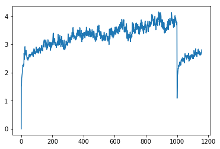
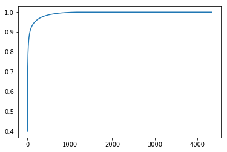
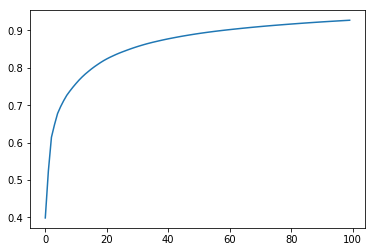
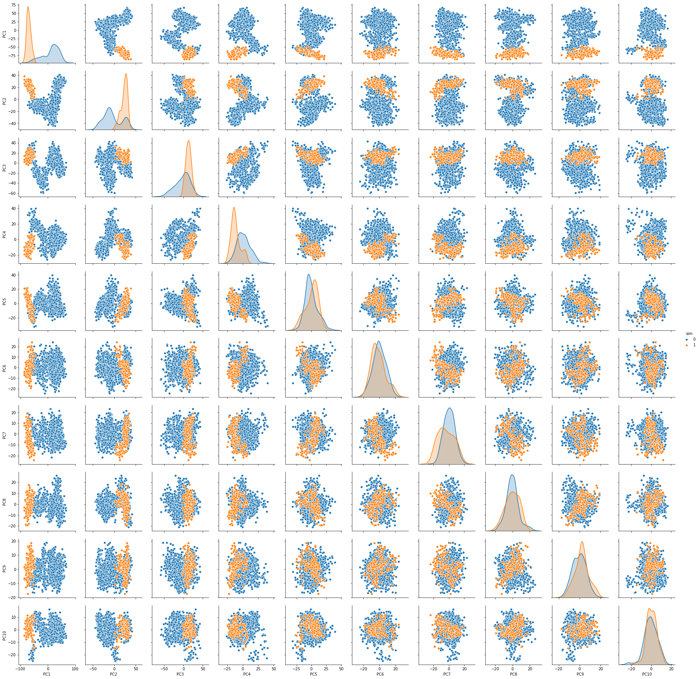

```python
import MDAnalysis

traj1=MDAnalysis.Universe('../../sim/complexwfe_M140I.prmtop','../dcd/complexwfe_M140I_1.dcd')
traj2=MDAnalysis.Universe('../../sim/complexwfe_M140I.prmtop','../dcd/complexwfe_M140I_2.dcd')
traj3=MDAnalysis.Universe('../../sim/complexwfe_M140I.prmtop','../dcd/complexwfe_M140I_3.dcd')
traj4=MDAnalysis.Universe('../../sim/complexwfe_M140I.prmtop','../dcd/complexwfe_M140I_4.dcd')
traj5=MDAnalysis.Universe('../../sim/complexwfe_M140I.prmtop','../dcd/complexwfe_M140I_5.dcd')
traj6=MDAnalysis.Universe('../../sim/complexwfe_M140I.prmtop','../dcd/complexwfe_M140I_6.dcd')
traj7=MDAnalysis.Universe('../../sim/complexwfe_M140I.prmtop','../dcd/complexwfe_M140I_7.dcd')
traj8=MDAnalysis.Universe('../../sim/complexwfe_M140I.prmtop','../dcd/complexwfe_M140I_8.dcd')
traj9=MDAnalysis.Universe('../../sim/complexwfe_M140I.prmtop','../dcd/complexwfe_M140I_9.dcd')
traj10=MDAnalysis.Universe('../../sim/complexwfe_M140I.prmtop','../dcd/complexwfe_M140I_10.dcd')
traj = MDAnalysis.Universe('../../sim/complexwfe_M140I.prmtop', ['../dcd/complexwfe_M140I_1.dcd','../dcd/complexwfe_M140I_2.dcd','../dcd/complexwfe_M140I_3.dcd','../dcd/complexwfe_M140I_4.dcd','../dcd/complexwfe_M140I_5.dcd','../dcd/complexwfe_M140I_6.dcd','../dcd/complexwfe_M140I_7.dcd','../dcd/complexwfe_M140I_8.dcd','../dcd/complexwfe_M140I_9.dcd','../dcd/complexwfe_M140I_10.dcd'])
```


```python
traj.trajectory
```


```python
from MDAnalysis.analysis.rms import rmsd #pull in rmsd function
prot = traj.select_atoms("protein") #only care about protein, not water/ions
refcoord = prot.positions #save initial coordinates
rmsds = [rmsd(refcoord,prot.positions) for ts in traj.trajectory]  #coordinates implicitly update as you iterat
```


```python
import matplotlib.pyplot as plt
import numpy as np
%matplotlib inline
```


```python
plt.plot(rmsds)
```


    [<matplotlib.lines.Line2D at 0x7f59b2f86090>]





```python
%%time
from MDAnalysis.analysis.align import AlignTraj
#align to loop

align = AlignTraj(traj, traj, select='backbone',filename='aligned.dcd')
align.run() 
```


```python
traj = MDAnalysis.Universe('../../sim/complexwfe_M140I.prmtop','aligned.dcd')
prot = traj.select_atoms("protein") #only care about protein, not water/ions
refcoord = prot.positions #save initial coordinates
rmsds = [rmsd(refcoord,prot.positions) for ts in traj.trajectory] 
traj.trajectory[-1] #set to last frame
lastcoord = prot.positions
lastrmsds = [rmsd(lastcoord,prot.positions) for ts in traj.trajectory]

plt.plot(rmsds,label='first')
plt.plot(lastrmsds,label='last')
plt.legend();
```


```python
#loading all the coordinates into memory takes about 1GB
coords = [prot.positions for ts in traj.trajectory]
```


```python
from MDAnalysis.analysis import pca
pc = pca.PCA(traj, select='name CA').run()
```


```python
plt.plot(pc.cumulated_variance)
```


    [<matplotlib.lines.Line2D at 0x7f59b576f710>]





```python
backbone = traj.select_atoms('name CA')
backbone
```


    <AtomGroup with 1448 atoms>


```python
plt.plot(pc.cumulated_variance[:100])
```


    [<matplotlib.lines.Line2D at 0x7f59b57aa6d0>]





```python
transformed = pc.transform(backbone, n_components=10)
```


```python
import pandas as pd
df = pd.DataFrame(transformed,
                  columns=['PC{}'.format(i+1) for i in range(10)])
df['sim'] = df.index//1000
df
```


<div>
<style scoped>
    .dataframe tbody tr th:only-of-type {
        vertical-align: middle;
    }

    .dataframe tbody tr th {
        vertical-align: top;
    }

    .dataframe thead th {
        text-align: right;
    }
</style>
<table border="1" class="dataframe">
  <thead>
    <tr style="text-align: right;">
      <th></th>
      <th>PC1</th>
      <th>PC2</th>
      <th>PC3</th>
      <th>PC4</th>
      <th>PC5</th>
      <th>PC6</th>
      <th>PC7</th>
      <th>PC8</th>
      <th>PC9</th>
      <th>PC10</th>
      <th>sim</th>
    </tr>
  </thead>
  <tbody>
    <tr>
      <th>0</th>
      <td>-57.462131</td>
      <td>5.426477</td>
      <td>6.763780</td>
      <td>-0.387361</td>
      <td>-17.948584</td>
      <td>16.173827</td>
      <td>-10.392501</td>
      <td>-3.782174</td>
      <td>-9.980783</td>
      <td>-14.833761</td>
      <td>0</td>
    </tr>
    <tr>
      <th>1</th>
      <td>-50.886571</td>
      <td>-0.035066</td>
      <td>1.695796</td>
      <td>-6.553865</td>
      <td>-12.875143</td>
      <td>20.295375</td>
      <td>-10.462714</td>
      <td>-5.843393</td>
      <td>-16.753790</td>
      <td>-16.444420</td>
      <td>0</td>
    </tr>
    <tr>
      <th>2</th>
      <td>-56.042684</td>
      <td>3.494632</td>
      <td>4.908775</td>
      <td>0.669473</td>
      <td>-15.637722</td>
      <td>16.500423</td>
      <td>-8.172350</td>
      <td>2.721630</td>
      <td>-16.290682</td>
      <td>-15.991669</td>
      <td>0</td>
    </tr>
    <tr>
      <th>3</th>
      <td>-67.912600</td>
      <td>12.412405</td>
      <td>3.799213</td>
      <td>9.296784</td>
      <td>-9.936956</td>
      <td>10.499597</td>
      <td>0.337142</td>
      <td>8.247816</td>
      <td>-11.606832</td>
      <td>-23.780583</td>
      <td>0</td>
    </tr>
    <tr>
      <th>4</th>
      <td>-57.915449</td>
      <td>0.035607</td>
      <td>19.612230</td>
      <td>12.708131</td>
      <td>-12.802918</td>
      <td>11.525563</td>
      <td>1.705140</td>
      <td>7.967349</td>
      <td>-10.195171</td>
      <td>-23.162136</td>
      <td>0</td>
    </tr>
    <tr>
      <th>5</th>
      <td>-53.399220</td>
      <td>4.488658</td>
      <td>16.700348</td>
      <td>13.910015</td>
      <td>-15.817868</td>
      <td>7.820633</td>
      <td>0.507994</td>
      <td>6.078920</td>
      <td>-8.954869</td>
      <td>-22.925014</td>
      <td>0</td>
    </tr>
    <tr>
      <th>6</th>
      <td>-59.354121</td>
      <td>0.505376</td>
      <td>18.247803</td>
      <td>10.661047</td>
      <td>-15.747958</td>
      <td>12.089360</td>
      <td>2.586596</td>
      <td>8.556361</td>
      <td>-5.903865</td>
      <td>-21.152476</td>
      <td>0</td>
    </tr>
    <tr>
      <th>7</th>
      <td>-58.608266</td>
      <td>3.534721</td>
      <td>16.627906</td>
      <td>15.817021</td>
      <td>-16.381123</td>
      <td>13.334286</td>
      <td>2.021907</td>
      <td>6.323993</td>
      <td>-8.097059</td>
      <td>-24.148233</td>
      <td>0</td>
    </tr>
    <tr>
      <th>8</th>
      <td>-61.545114</td>
      <td>5.538516</td>
      <td>24.219806</td>
      <td>16.967215</td>
      <td>-15.271678</td>
      <td>7.610245</td>
      <td>9.665535</td>
      <td>2.000694</td>
      <td>-7.735719</td>
      <td>-22.291807</td>
      <td>0</td>
    </tr>
    <tr>
      <th>9</th>
      <td>-63.327571</td>
      <td>7.070347</td>
      <td>14.370331</td>
      <td>13.300700</td>
      <td>-16.100938</td>
      <td>2.766948</td>
      <td>11.149526</td>
      <td>-0.987621</td>
      <td>-7.755428</td>
      <td>-18.430379</td>
      <td>0</td>
    </tr>
    <tr>
      <th>10</th>
      <td>-61.542093</td>
      <td>8.382515</td>
      <td>13.765721</td>
      <td>24.522186</td>
      <td>-13.885492</td>
      <td>-0.403505</td>
      <td>9.975563</td>
      <td>1.452706</td>
      <td>-4.876442</td>
      <td>-23.494875</td>
      <td>0</td>
    </tr>
    <tr>
      <th>11</th>
      <td>-57.444415</td>
      <td>3.158250</td>
      <td>24.667923</td>
      <td>20.114784</td>
      <td>-22.968442</td>
      <td>0.590281</td>
      <td>12.980968</td>
      <td>-0.088067</td>
      <td>-8.748140</td>
      <td>-19.268488</td>
      <td>0</td>
    </tr>
    <tr>
      <th>12</th>
      <td>-56.176201</td>
      <td>2.314342</td>
      <td>8.358909</td>
      <td>17.430934</td>
      <td>-15.848974</td>
      <td>4.022923</td>
      <td>-1.184398</td>
      <td>3.999612</td>
      <td>-6.456652</td>
      <td>-24.890720</td>
      <td>0</td>
    </tr>
    <tr>
      <th>13</th>
      <td>-59.827496</td>
      <td>1.739822</td>
      <td>19.222374</td>
      <td>18.695500</td>
      <td>-16.107601</td>
      <td>2.549328</td>
      <td>8.655391</td>
      <td>1.311346</td>
      <td>-6.863783</td>
      <td>-17.637226</td>
      <td>0</td>
    </tr>
    <tr>
      <th>14</th>
      <td>-61.442776</td>
      <td>2.391303</td>
      <td>21.436291</td>
      <td>20.831418</td>
      <td>-19.108759</td>
      <td>2.187622</td>
      <td>3.530516</td>
      <td>-3.352605</td>
      <td>-9.071739</td>
      <td>-16.754936</td>
      <td>0</td>
    </tr>
    <tr>
      <th>15</th>
      <td>-53.950091</td>
      <td>-5.587121</td>
      <td>18.575005</td>
      <td>20.745861</td>
      <td>-19.001312</td>
      <td>2.291210</td>
      <td>4.951357</td>
      <td>-2.532072</td>
      <td>-10.326052</td>
      <td>-20.211446</td>
      <td>0</td>
    </tr>
    <tr>
      <th>16</th>
      <td>-58.072220</td>
      <td>-0.023600</td>
      <td>11.591864</td>
      <td>22.772786</td>
      <td>-11.003314</td>
      <td>2.960935</td>
      <td>6.244411</td>
      <td>-3.078296</td>
      <td>-12.675389</td>
      <td>-23.531698</td>
      <td>0</td>
    </tr>
    <tr>
      <th>17</th>
      <td>-57.918081</td>
      <td>-1.878868</td>
      <td>13.812078</td>
      <td>23.947261</td>
      <td>-16.742439</td>
      <td>3.832117</td>
      <td>-1.851758</td>
      <td>-1.467613</td>
      <td>-10.776281</td>
      <td>-21.723232</td>
      <td>0</td>
    </tr>
    <tr>
      <th>18</th>
      <td>-61.373094</td>
      <td>3.409574</td>
      <td>35.161270</td>
      <td>39.181918</td>
      <td>-22.941688</td>
      <td>-3.157490</td>
      <td>7.900059</td>
      <td>-6.792239</td>
      <td>-9.240940</td>
      <td>-22.765020</td>
      <td>0</td>
    </tr>
    <tr>
      <th>19</th>
      <td>-70.122799</td>
      <td>-3.479782</td>
      <td>31.038549</td>
      <td>34.354254</td>
      <td>-16.998095</td>
      <td>1.933173</td>
      <td>7.478779</td>
      <td>-1.073567</td>
      <td>-8.976599</td>
      <td>-19.741208</td>
      <td>0</td>
    </tr>
    <tr>
      <th>20</th>
      <td>-55.512006</td>
      <td>-2.461858</td>
      <td>25.481943</td>
      <td>24.593134</td>
      <td>-25.355585</td>
      <td>-5.824586</td>
      <td>5.166913</td>
      <td>-1.816839</td>
      <td>-12.316056</td>
      <td>-18.387478</td>
      <td>0</td>
    </tr>
    <tr>
      <th>21</th>
      <td>-53.117336</td>
      <td>-4.487306</td>
      <td>40.149654</td>
      <td>29.223802</td>
      <td>-27.312806</td>
      <td>-5.134570</td>
      <td>6.916728</td>
      <td>1.950123</td>
      <td>-5.963100</td>
      <td>-12.091475</td>
      <td>0</td>
    </tr>
    <tr>
      <th>22</th>
      <td>-50.753762</td>
      <td>-7.270502</td>
      <td>29.853794</td>
      <td>31.743040</td>
      <td>-19.526604</td>
      <td>-3.623980</td>
      <td>1.063446</td>
      <td>-0.344449</td>
      <td>-4.750934</td>
      <td>-15.427332</td>
      <td>0</td>
    </tr>
    <tr>
      <th>23</th>
      <td>-55.062090</td>
      <td>-4.561978</td>
      <td>27.796178</td>
      <td>34.587245</td>
      <td>-24.581759</td>
      <td>-2.114362</td>
      <td>4.675730</td>
      <td>-0.871237</td>
      <td>1.181171</td>
      <td>-14.260012</td>
      <td>0</td>
    </tr>
    <tr>
      <th>24</th>
      <td>-44.891986</td>
      <td>0.135179</td>
      <td>42.864283</td>
      <td>39.957120</td>
      <td>-31.363537</td>
      <td>-14.708592</td>
      <td>6.669427</td>
      <td>2.389191</td>
      <td>-1.959706</td>
      <td>-14.478952</td>
      <td>0</td>
    </tr>
    <tr>
      <th>25</th>
      <td>-50.557340</td>
      <td>-4.387636</td>
      <td>35.213887</td>
      <td>37.073870</td>
      <td>-31.995833</td>
      <td>-6.723755</td>
      <td>13.066530</td>
      <td>-2.387130</td>
      <td>3.691038</td>
      <td>-9.051158</td>
      <td>0</td>
    </tr>
    <tr>
      <th>26</th>
      <td>-47.831062</td>
      <td>-11.848264</td>
      <td>23.023005</td>
      <td>35.171667</td>
      <td>-24.500458</td>
      <td>-1.912549</td>
      <td>4.420910</td>
      <td>0.305188</td>
      <td>-2.669956</td>
      <td>-9.813556</td>
      <td>0</td>
    </tr>
    <tr>
      <th>27</th>
      <td>-58.969478</td>
      <td>-13.761583</td>
      <td>39.091709</td>
      <td>35.468285</td>
      <td>-23.509937</td>
      <td>0.625188</td>
      <td>10.409226</td>
      <td>3.392615</td>
      <td>-6.905753</td>
      <td>-9.214387</td>
      <td>0</td>
    </tr>
    <tr>
      <th>28</th>
      <td>-56.766900</td>
      <td>-7.473999</td>
      <td>34.828411</td>
      <td>36.082949</td>
      <td>-26.565218</td>
      <td>-6.810849</td>
      <td>15.099630</td>
      <td>0.476601</td>
      <td>-7.477187</td>
      <td>-4.248130</td>
      <td>0</td>
    </tr>
    <tr>
      <th>29</th>
      <td>-67.351737</td>
      <td>-7.152164</td>
      <td>33.696252</td>
      <td>33.669962</td>
      <td>-16.503324</td>
      <td>2.208925</td>
      <td>17.873933</td>
      <td>-2.457044</td>
      <td>-3.552501</td>
      <td>-3.782828</td>
      <td>0</td>
    </tr>
    <tr>
      <th>...</th>
      <td>...</td>
      <td>...</td>
      <td>...</td>
      <td>...</td>
      <td>...</td>
      <td>...</td>
      <td>...</td>
      <td>...</td>
      <td>...</td>
      <td>...</td>
      <td>...</td>
    </tr>
    <tr>
      <th>1129</th>
      <td>-80.665460</td>
      <td>25.839691</td>
      <td>3.558126</td>
      <td>-19.127166</td>
      <td>13.847979</td>
      <td>-1.789544</td>
      <td>7.230623</td>
      <td>-8.106229</td>
      <td>-7.153212</td>
      <td>-3.336500</td>
      <td>1</td>
    </tr>
    <tr>
      <th>1130</th>
      <td>-78.284289</td>
      <td>27.879700</td>
      <td>15.146080</td>
      <td>-18.064099</td>
      <td>11.833174</td>
      <td>-4.110944</td>
      <td>11.153383</td>
      <td>-10.854560</td>
      <td>-3.974518</td>
      <td>-2.556124</td>
      <td>1</td>
    </tr>
    <tr>
      <th>1131</th>
      <td>-78.975510</td>
      <td>30.966583</td>
      <td>9.369621</td>
      <td>-21.554199</td>
      <td>15.283020</td>
      <td>3.217038</td>
      <td>5.943945</td>
      <td>-6.527499</td>
      <td>-1.147827</td>
      <td>-3.744809</td>
      <td>1</td>
    </tr>
    <tr>
      <th>1132</th>
      <td>-72.744497</td>
      <td>30.871974</td>
      <td>15.755178</td>
      <td>-10.644140</td>
      <td>12.871459</td>
      <td>-9.424462</td>
      <td>8.454180</td>
      <td>-8.283603</td>
      <td>0.145969</td>
      <td>-4.252346</td>
      <td>1</td>
    </tr>
    <tr>
      <th>1133</th>
      <td>-79.610106</td>
      <td>30.341652</td>
      <td>18.204765</td>
      <td>-10.112894</td>
      <td>5.684292</td>
      <td>-6.736745</td>
      <td>16.001843</td>
      <td>-6.681654</td>
      <td>-4.073913</td>
      <td>-2.698534</td>
      <td>1</td>
    </tr>
    <tr>
      <th>1134</th>
      <td>-80.449911</td>
      <td>29.231640</td>
      <td>22.018367</td>
      <td>-8.441060</td>
      <td>9.560082</td>
      <td>-13.067706</td>
      <td>8.362799</td>
      <td>-10.957682</td>
      <td>-4.105294</td>
      <td>-2.345881</td>
      <td>1</td>
    </tr>
    <tr>
      <th>1135</th>
      <td>-77.066666</td>
      <td>31.232925</td>
      <td>5.568388</td>
      <td>-15.217615</td>
      <td>12.083579</td>
      <td>-8.260486</td>
      <td>8.366595</td>
      <td>-5.500241</td>
      <td>2.313462</td>
      <td>-4.054892</td>
      <td>1</td>
    </tr>
    <tr>
      <th>1136</th>
      <td>-85.578779</td>
      <td>32.828403</td>
      <td>7.088901</td>
      <td>-14.346508</td>
      <td>13.787278</td>
      <td>-7.017369</td>
      <td>10.110151</td>
      <td>-2.803693</td>
      <td>1.744875</td>
      <td>-4.517460</td>
      <td>1</td>
    </tr>
    <tr>
      <th>1137</th>
      <td>-85.569060</td>
      <td>26.809126</td>
      <td>14.522310</td>
      <td>-10.070269</td>
      <td>12.519675</td>
      <td>-3.971706</td>
      <td>10.357023</td>
      <td>-5.826489</td>
      <td>-6.523797</td>
      <td>1.045193</td>
      <td>1</td>
    </tr>
    <tr>
      <th>1138</th>
      <td>-80.562878</td>
      <td>29.903106</td>
      <td>15.856460</td>
      <td>-9.450812</td>
      <td>13.111341</td>
      <td>-8.480064</td>
      <td>7.938185</td>
      <td>-3.954757</td>
      <td>0.752921</td>
      <td>0.202772</td>
      <td>1</td>
    </tr>
    <tr>
      <th>1139</th>
      <td>-72.489037</td>
      <td>30.082059</td>
      <td>19.832792</td>
      <td>-12.691088</td>
      <td>4.761452</td>
      <td>-3.550043</td>
      <td>8.344027</td>
      <td>-13.908524</td>
      <td>-0.852315</td>
      <td>2.880641</td>
      <td>1</td>
    </tr>
    <tr>
      <th>1140</th>
      <td>-72.813613</td>
      <td>31.121481</td>
      <td>24.122273</td>
      <td>-3.201593</td>
      <td>0.625072</td>
      <td>-5.945144</td>
      <td>15.513989</td>
      <td>-6.012240</td>
      <td>1.114019</td>
      <td>-2.568953</td>
      <td>1</td>
    </tr>
    <tr>
      <th>1141</th>
      <td>-76.428162</td>
      <td>33.570285</td>
      <td>23.852522</td>
      <td>-9.271916</td>
      <td>6.531567</td>
      <td>-3.428318</td>
      <td>19.162381</td>
      <td>-2.483373</td>
      <td>3.627655</td>
      <td>3.184811</td>
      <td>1</td>
    </tr>
    <tr>
      <th>1142</th>
      <td>-73.760234</td>
      <td>32.311776</td>
      <td>27.238634</td>
      <td>-7.446886</td>
      <td>9.097225</td>
      <td>-1.775694</td>
      <td>15.638094</td>
      <td>1.343303</td>
      <td>2.438750</td>
      <td>-3.801144</td>
      <td>1</td>
    </tr>
    <tr>
      <th>1143</th>
      <td>-70.921310</td>
      <td>33.444968</td>
      <td>16.192775</td>
      <td>-7.973988</td>
      <td>7.054751</td>
      <td>-5.517178</td>
      <td>12.858095</td>
      <td>-5.933375</td>
      <td>5.294300</td>
      <td>-4.697062</td>
      <td>1</td>
    </tr>
    <tr>
      <th>1144</th>
      <td>-69.976162</td>
      <td>22.567735</td>
      <td>24.723736</td>
      <td>-7.269944</td>
      <td>5.282833</td>
      <td>-7.312310</td>
      <td>11.861925</td>
      <td>-5.148409</td>
      <td>3.348843</td>
      <td>-0.694069</td>
      <td>1</td>
    </tr>
    <tr>
      <th>1145</th>
      <td>-74.389920</td>
      <td>26.294320</td>
      <td>14.251099</td>
      <td>-11.981790</td>
      <td>10.941105</td>
      <td>-7.050946</td>
      <td>12.333893</td>
      <td>-3.679495</td>
      <td>2.888645</td>
      <td>0.063059</td>
      <td>1</td>
    </tr>
    <tr>
      <th>1146</th>
      <td>-71.723631</td>
      <td>27.802988</td>
      <td>13.636800</td>
      <td>-12.116723</td>
      <td>8.202487</td>
      <td>-8.268939</td>
      <td>10.677451</td>
      <td>-4.823927</td>
      <td>-0.240037</td>
      <td>-1.369841</td>
      <td>1</td>
    </tr>
    <tr>
      <th>1147</th>
      <td>-64.753743</td>
      <td>27.181757</td>
      <td>16.064319</td>
      <td>-17.553923</td>
      <td>-1.666623</td>
      <td>-11.846927</td>
      <td>10.422823</td>
      <td>-10.237563</td>
      <td>4.778510</td>
      <td>2.274420</td>
      <td>1</td>
    </tr>
    <tr>
      <th>1148</th>
      <td>-70.529286</td>
      <td>27.985431</td>
      <td>15.280842</td>
      <td>-22.517125</td>
      <td>4.980940</td>
      <td>-3.073365</td>
      <td>16.076023</td>
      <td>-7.813922</td>
      <td>3.482114</td>
      <td>1.593037</td>
      <td>1</td>
    </tr>
    <tr>
      <th>1149</th>
      <td>-73.101854</td>
      <td>26.368515</td>
      <td>14.418659</td>
      <td>-12.522816</td>
      <td>4.852921</td>
      <td>-8.871224</td>
      <td>9.773483</td>
      <td>-12.261570</td>
      <td>4.929437</td>
      <td>-2.330221</td>
      <td>1</td>
    </tr>
    <tr>
      <th>1150</th>
      <td>-60.904881</td>
      <td>23.880829</td>
      <td>15.933479</td>
      <td>-16.599577</td>
      <td>-1.174533</td>
      <td>-17.581919</td>
      <td>7.435187</td>
      <td>-6.014737</td>
      <td>-2.963585</td>
      <td>1.437622</td>
      <td>1</td>
    </tr>
    <tr>
      <th>1151</th>
      <td>-66.814554</td>
      <td>25.407777</td>
      <td>19.808409</td>
      <td>-13.096892</td>
      <td>6.073113</td>
      <td>-13.375638</td>
      <td>10.473848</td>
      <td>-6.350286</td>
      <td>1.724671</td>
      <td>1.362009</td>
      <td>1</td>
    </tr>
    <tr>
      <th>1152</th>
      <td>-73.088019</td>
      <td>25.126861</td>
      <td>15.930489</td>
      <td>-13.439744</td>
      <td>8.625324</td>
      <td>-5.612428</td>
      <td>14.498207</td>
      <td>-1.042040</td>
      <td>1.585853</td>
      <td>-3.341835</td>
      <td>1</td>
    </tr>
    <tr>
      <th>1153</th>
      <td>-68.871874</td>
      <td>26.428190</td>
      <td>17.745538</td>
      <td>-17.732782</td>
      <td>10.917352</td>
      <td>-8.631501</td>
      <td>9.962449</td>
      <td>-5.858852</td>
      <td>-2.863896</td>
      <td>0.949057</td>
      <td>1</td>
    </tr>
    <tr>
      <th>1154</th>
      <td>-65.979122</td>
      <td>29.316820</td>
      <td>12.690928</td>
      <td>-14.032551</td>
      <td>12.348992</td>
      <td>-8.293564</td>
      <td>10.108163</td>
      <td>-3.062311</td>
      <td>1.313296</td>
      <td>4.106712</td>
      <td>1</td>
    </tr>
    <tr>
      <th>1155</th>
      <td>-68.054710</td>
      <td>25.693550</td>
      <td>5.979957</td>
      <td>-14.439641</td>
      <td>9.269115</td>
      <td>-7.116996</td>
      <td>11.918787</td>
      <td>1.827207</td>
      <td>4.351617</td>
      <td>-3.475945</td>
      <td>1</td>
    </tr>
    <tr>
      <th>1156</th>
      <td>-72.817828</td>
      <td>30.504993</td>
      <td>9.419006</td>
      <td>-15.996810</td>
      <td>12.174854</td>
      <td>-6.397111</td>
      <td>14.956425</td>
      <td>-0.133382</td>
      <td>3.281939</td>
      <td>-3.912764</td>
      <td>1</td>
    </tr>
    <tr>
      <th>1157</th>
      <td>-62.141836</td>
      <td>30.842277</td>
      <td>13.575023</td>
      <td>-14.745568</td>
      <td>12.928952</td>
      <td>-12.884467</td>
      <td>10.581032</td>
      <td>-5.393050</td>
      <td>1.878304</td>
      <td>0.417030</td>
      <td>1</td>
    </tr>
    <tr>
      <th>1158</th>
      <td>-65.503630</td>
      <td>32.949364</td>
      <td>11.020427</td>
      <td>-17.489825</td>
      <td>10.912115</td>
      <td>-10.127109</td>
      <td>12.524762</td>
      <td>-3.192300</td>
      <td>4.092792</td>
      <td>-0.667773</td>
      <td>1</td>
    </tr>
  </tbody>
</table>
<p>1159 rows × 11 columns</p>
</div>


```python
import seaborn as sns
g = sns.pairplot(df,vars=('PC1','PC2','PC3','PC4','PC5','PC6','PC7','PC8','PC9','PC10'),hue='sim')
```




