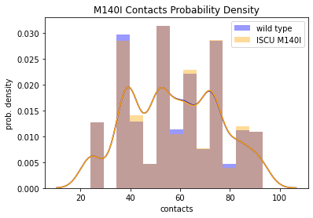
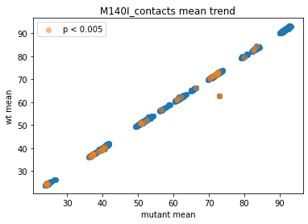
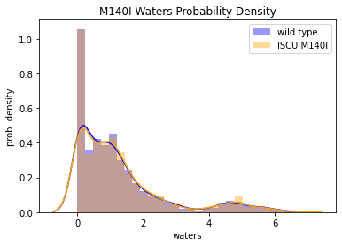
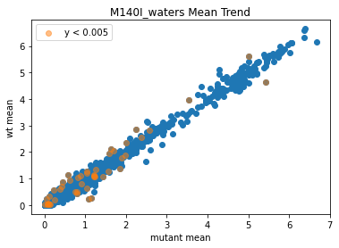
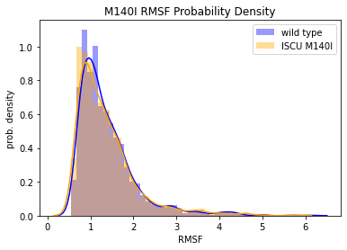
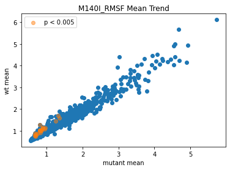

```python
import pandas as pd
import matplotlib.pyplot as plt
import seaborn as sns

cont = pd.read_csv("../compare/contacts_scored.csv")
cont_sig = cont.query("p_score < 0.005")

sns.distplot(cont['wt_mean'], color = "blue")
sns.distplot(cont['mutant_mean'], color = "orange")
plt.legend(labels = ['wild type', 'ISCU M140I'])
plt.xlabel("contacts")
plt.ylabel("prob. density")
plt.title("M140I Contacts Probability Density")

```


    Text(0.5, 1.0, 'M140I Contacts Probability Density')





```python
cont_x = cont["mutant_mean"]
cont_y = cont['wt_mean']
cont_p = cont["p_score"]
resid = cont["resid"]

plt.scatter(cont_x, cont_y)
plt.scatter( cont_sig["mutant_mean"],cont_sig['wt_mean'], alpha = 0.5, label = "p < 0.005")

plt.xlabel("mutant mean")
plt.ylabel("wt mean")
plt.title("M140I_contacts mean trend")
plt.legend()

        
```


    <matplotlib.legend.Legend at 0x7f93a90fb890>





```python
wat = pd.read_csv("../compare/waters_scored.csv")
wat_sig = wat.query("p_score < 0.005")

sns.distplot(wat['wt_mean'], color = "blue")
sns.distplot(wat['mutant_mean'], color = "orange")
plt.legend(labels = ['wild type', 'ISCU M140I'])
plt.xlabel("waters")
plt.ylabel("prob. density")
plt.title("M140I Waters Probability Density")
```


    Text(0.5, 1.0, 'M140I Waters Probability Density')





```python
wat_x = wat["mutant_mean"]
wat_y = wat['wt_mean']
wat_p = wat["p_score"]
resid = wat["resid"]

plt.scatter(wat_x, wat_y)
plt.scatter(wat_sig['mutant_mean'],wat_sig['wt_mean'], alpha = 0.5, label = "y < 0.005")

plt.xlabel("mutant mean")
plt.ylabel("wt mean")
plt.title("M140I_waters Mean Trend")
plt.legend()

```


    <matplotlib.legend.Legend at 0x7f93a901ec10>





```python
rmsf = pd.read_csv("../compare/rmsfs_scored.csv")
rmsf_sig = rmsf.query("p_score < 0.005")

sns.distplot(rmsf['wt_mean'], color = "blue")
sns.distplot(rmsf['mutant_mean'], color = "orange")
plt.legend(labels = ['wild type', 'ISCU M140I'])
plt.xlabel("RMSF")
plt.ylabel("prob. density")
plt.title("M140I RMSF Probability Density")
```


    Text(0.5, 1.0, 'M140I RMSF Probability Density')





```python
rmsf_x = rmsf["mutant_mean"]
rmsf_y = rmsf['wt_mean']
rmsf_p = rmsf["p_score"]
resid = rmsf["resid"]

plt.scatter(rmsf_x, rmsf_y)
plt.scatter(rmsf_sig['mutant_mean'],rmsf_sig['wt_mean'],alpha = 0.5, label = "p < 0.005")

plt.xlabel("mutant mean")
plt.ylabel("wt mean")
plt.title("M140I_RMSF Mean Trend")
plt.legend()
```


    <matplotlib.legend.Legend at 0x7f93a8fe6510>





```python

```
